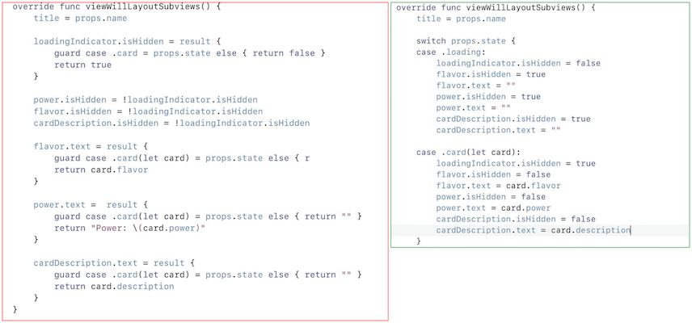

### Tips to imporove you productivity
 
1. If you don’t know the exact build time of your project, enable the following option in Xcode. At least you’ll see how long you have to procrastinate until the build will be ready.

        defaults write http://com.apple .dt.Xcode ShowBuildOperationDuration -bool YES

2. Don’t want to procrastinate? Here is how to improve your Swift build time with a simple internal Xcode 9.2 property. Obviously, not a silver bullet but worth a try

        defaults write http://com.apple .dt.Xcode BuildSystemScheduleInherentlyParallelCommandsExclusively -bool YES

3. With Xcode 9 first release many of us were excited about ability to launch iOS simulator and Xcode in full-screen mode. You can just execute the following command in the terminal

        defaults write http://com.apple.iphonesimulator AllowFullscreenMode -bool YES

4. Avoiding Massive View Controllers is all about finding the right levels of abstraction and splitting things up

    This is done to avoid non-optional optionals. Since a VC's views shouldn't be created at init, but rather when its view is loaded, lets can't be used. Lazy properties are created when first accessed.

        // BEFORE
        class LoginViewController: UIViewController {
            private lazy var signUpLabel = UILabel()
            private lazy var signUpImageView = UIImageView()
            private lazy var signUpButton = UIButton()
        }

        // AFTER
        class LoginViewController: UIViewController {
            private lazy var signUpView = SignUpView()
        }

        class SignUpView: UIView {
            private lazy var label = UILabel()
            private lazy var imageView = UIImageView()
            private lazy var buutton = UIButton()
        }

5. "Result-oriented code structure" vs "Input oriented code structure". In my experience, the result-oriented structre is more robust in terms of support and extension.

6. Even if you define a custom raw value for a string-based enum in Swift, the full case name will be used in string interpolation. Super useful when using separate raw values for JSON, while still wanting to use the full case name in other contexts.

        extension Building {
            
            enum Kind: String {
                case castle = "C"
                case town = "T"
                case barracks = "B"
                case goldMine = "M"
            }
        }

        // String interpolation
        let buildingIdent = "building-\(building.kind)" // building-castle
            
        // Normal referencing
        let value = building.kind.rawValue // C

7. Use private framework in Playgrounds

        Bundle(path: “path to private framework”)?.load() // to load private framework
        let ClassName = NSClassFromString(“class name”) // to get required class
        var variable = ClassName.init() // to initialize variable
        variable.perform(NSSelectorFromString(“selector name”) with:<arguments>) // to execute method

8. If you intensely use git in Terminal this option may simplify your life a bit while reviewing diffs.

        git diff --color-moved=zebra

    To show moved lines different from adds/deletes. Set permanently with:

        git config --global diff.colorMoved zebra

9. Easy way to convert _String_ to _Data_.

        Data(str.utf8) 

        vs

        str.data(using: .utf8)!

10. Remove all unavailable simulators from Xcode to save some space

        xcrun simctl delete unavailable

11. A way to make optional chaining easier and more readable

        let a: Double? = 1.0
        let b: Double? = 2.0
        let c: Double? = 3.0
        let d: Double? = 4.0
        let e: Double? = 5.0
        let f: Double? = 6.0
        let g: Double? = 7.0

        extension Optional {
            func `or`(_ value : Wrapped?) -> Optional {
                return self ?? value
            }
            func `or`(_ value: Wrapped) -> Wrapped {
                return self ?? value
            }
        }

        //let result = a ?? b ?? c ?? d ?? e ?? f ?? g ?? 1.0       // <---  This will fail to compile
        let result = a.or(b).or(c).or(d).or(e).or(f).or(g).or(1.0)  // <--- This will not

12. If you use Core Data or Realm in a multithreaded setup, you can make your life simpler by following this rule:

       - main thread/context ⇒ **ONLY** _reads_ from the database
       - background thread/context ⇒ _creates_, _reads_, _updates_ and _deletes_ from the database

13. When Unit Testing, the ⌃⌥⌘U shortcut does different things depending on the current cursor location:

       - Inside a test _method_: Runs this single test method
       - Inside an _XCTestCase_ subclass but outside of any method: Runs all tests in the class

14. Easy way to append a value to an arry to a dictionary with arrays as its values [WIP]

        dict[key, default: []].append(val)

        vs

        var list = dict[key] ?? []
        list.append(val)
        dict[key] = list

15. Use **e** when debugging instead of **po** to give you MUCH more info in a more readable format.

16. Last one is tip for Bad Swift Coding / Trolling

    Did you know you can use keyword quoting as \`sarcasm quotes\`?

        let `true` = false
        
        if `true` {
            //don't do stuff
        }