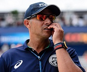
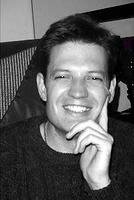

# Tech Ketchup

Welcome to the first edition of Tech Ketchup. Your monthly Global Kinetic technical newsletter.
Before we start and dive straight into everybody's favourite topics I though it appropriate to meet
the team behind it all.

### Mark Isaacs


Member of the **Global Kinetic Core Group** and **Head of Technology**.
My life is ruled by 2 women outside of work by my wonderful wife Colleen and 11 year old daughter Hannah.

I come from an Electrical Engineering background where my passion for technology started.
I've always had a love for been at the edge of technology pushing the boundaries.
This shows in my career having been part of the Saldanha Steel commissioning team as an engineer and also part of the development team that launched 20twenty online bank.
I remember the 20twenty days where there was just 3 of us working crazy 16-18 hour days (including weekends) so that we could hit the launch deadline.

Besides technology I have a love for animals and spend my Saturday afternoons at the local dog club.
I'm currently doing agility training with the baby in the family (x-breed dog named Anniken).


### Michael Sobremonte


**Techno Guy** 👨‍💻🤖

Born in the pacific islands; where the domain is PH (no the H does not stand for Hub).  
Grew up in a small KZN town. Parent to two annoyingly adorable tornadoes. 🌪️🌪️

My nerdiness began as a child after _acquiring_ a bricked 286.  
Got zapped by the broken PSU, tripped the house and the rest is history.  
Became a child scavenger [of PC parts], gamer, irc addict, BOFH/SysAdmin to polyglot dev and focused mainly on Java/EE.  
Juggled between roles and went through confusing times coming out partly as a DevOps Engineer.

I generally just have a knack for finding/solving problems (and trying not to create them).  
Have a fetish for all things tech, OSS, DevOps and geeky hardware.

Today I'm a mixed bag **Senior Technologist** and partly perform therapy/lead duties for the AA (Android Anonymous) group.  
I currently reside at the furthest reaches of the dungeon like a rare hobbit.

### Niel Joubert :beer: :running:


**iOS Tech Lead**

I've been on the shiny _iOS_ train since mid-2012 after getting bored out of my mind doing SAP work at Shoprite. I started off doing native _iOS_ and _Android_ apps, but evidently moved over to _iOS_ as it was more in demand back then. I dabbled in some _HTML5_ and _Javascript_ building the websites that the apps were designed for.

My love/enjoyment of coding stems from the good old days at Varsity where we were forced to do _C_ programming on Linux in a text editor. Later in my studies I moved on to _Java_ which was a lot more 'fun' and (O)OP.

Studying BEngSci (Engineering Science focussing on Applied Mathematics and Computer Systems) exposed me hardware level coding in _Assembler_, some _Ruby on Rails_ and some nice image processing using _OpenCV_ and _MATLAB_. Fair to say that _iOS_ came out the winner out of all the languages.

I played club cricket through my years at Varsity and the first few years as a code monkey. After we moved further away from Stellenbosch I had to find new hobbies which turned out to be Beer Brewing and Trail Running. Yes they _go together like peas and carrots_, you need something to quench your thirst when you're done running around the mountains like a mad man.


### Henk Roux :wrench:


**.NET** tech lead and part of the Team Ninja API development team.

I parent, drive, <s>hobby</s> DIY, game and code. I have collections of several types of things. I
pride myself in keeping things realistic and honest, uncomplicated and positive. I started coding in
Q-Basic, was taught in Turbo Pascal, graduated in C++ and Java, and earn in C# and JavaScript.
I've worked on projects for syndicators, farmers, investment houses and banks. I have not completed
a game yet.

[Site](http://www.helloserve.com) | [Twitter](https://twitter.com/helloserve) | [GitHub](https://github.com/helloserve)

### Adam Cleworth


**IT/Infrastructure Manager**

I can read firewall rules and score a cricket match.

I'm 1 part geek, 2 parts taxi driver, 3 parts cricket coach.

### Hendrik Volskenk :star:


_Front-end tech lead_

I have been a tennis coach, touring drummer and a programmer. Originally from Centurion, I grew up
with two sisters and two brothers on a small farm, left to our own devices, mostly.

My love for programming started at school when I was introduced to _Turbo Pascal_ and later did a
course in _Delphi_. I went on to learn _.Net_, and fell in love with _PHP_ at my second job.
I continued working as a _PHP_ developer for several years, building small-medium sized applications
in the entertainment industry (mixing bands and programming). Only after moving to Cape Town my love
affair with _JavaScript_ truly started, and is still ongoing.

I work on my own programming side-project(s) in my spare time, which you are welcome to come and ask
me about.

[GitHub](https://github.com/hvolschenk)

### Giovanni Bake



**Database Architect** and a member of the Team Ninja API team

I am an International Beach Volleyball Referee (yes, for the ladies too), a musician, a sport lover
(doing and watching) and I seem to hate sleep.

I love solving complex problems and this lead me to the database optimisation space. Taking processes
that run for hours and reducing that execution time is what gets me excited. I prefer spending time
thinking about and designing possible solutions than typing lines of code (or documents where I
introduce myself).

My introduction to programming was with _Basic_, used _C++_ at Uni and now I'm _C#_-ing.

### Razeen Hendricks


**Senior Java Developer** playing a lead role in the Java space of the Old Mutual API team

A veteran of the bicycle after having completed 16 Argus cycle tours (until my back called it a day), I
also enjoy the challenge of league table-tennis matches as well as mountain hiking.

I started my programming career with Delphi, following which the rise in Java popularity convinced me
to migrate to a trendier language of the time. I have spent much time as a full-stack developer, though
lately I've concentrated my efforts on server-side development where most of the complexity lies.

### Renier Botes



**C# / Scala Guy**

Veteran software developer (18+ years of experience), although I would argue I look younger than most other people that's been programming this long.

Started out with GW-BASIC when I was (too young to remember) and eventually got "formal" training in school from grade 8.
Not many people know this, but I started university as a BSc Biochemistry student.
Hated chemistry and decided to rather study what I really love doing, namely programming (BSc Computer Science).

Career started out as C++ developer, sort of morphed into a Managed C++ developer for a while and eventually made the transition to C#.

Have delved into various technologies and platforms over the years:
```
Architectures:
- Monolith (who hasn't?)
- Message Bus (aka ESB)
- SOA
- Microservices
Languages:
- C#
- Scala
- C/C++
- Java
- Javascript
- Prolog, etc.
Databases:
- SQL Server (T-SQL)
- Oracle
- MongoDB
- Couchebase
- Redis, etc.
Network and Protocol:
- TCP/IP, SSL/TLS
- HTTP
- Google Protocol Buffers
- SignalR
- WebSockets, etc.
Other:
- Docker
- RabbitMQ
- Rx (Reactive Extensions)
- WiX (Windows Installer XML), etc.
Passions:
- Clean Code
- Architecture
- Machine Learning
- Algorithmic Trading
```

Currently the technical lead for the Future Bank product.

[LinkedIn](https://www.linkedin.com/in/renierbotes)|[Github](https://github.com/renierb)