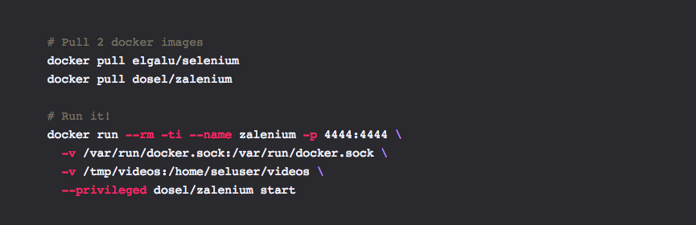
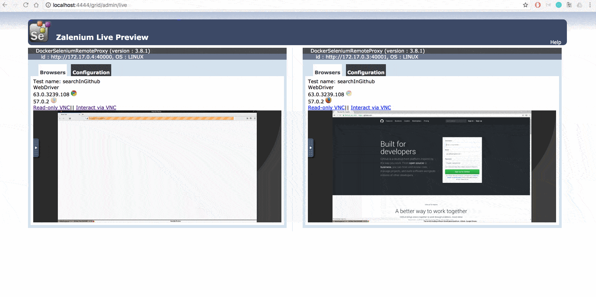
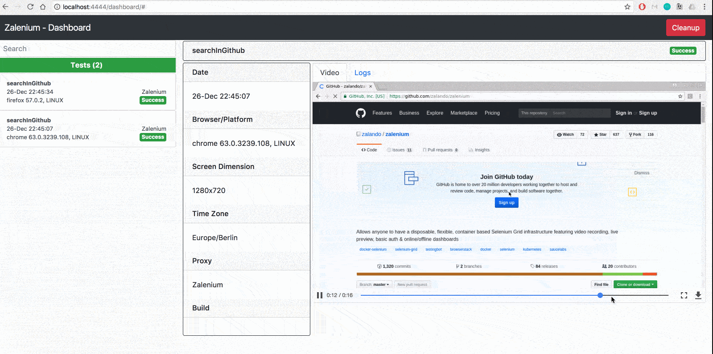

# QA

## Selenium grid made better with Zalenium

## Problem
One of the biggest challenges testers face with Selenium is having a stable grid infrastructure and being able to keep it maintained with new versions of browsers and selenium drivers

## Solution

I’ve been using [Zalenium](https://github.com/zalando/zalenium) for the past few years which has helped get my web automation to run smoothly and cost effectively.

Zalenium is basically a [Selenium Grid](https://github.com/SeleniumHQ/selenium/wiki/Grid2) extension allows you to have a disposable, flexible container based infrastructure to run your tests in Firefox and Chrome locally, and when you need a different browser, your tests can get redirected to a cloud testing provider (Sauce Labs, BrowserStack, TestingBot).

Here’s how easy it is to setup and use:

*	Pull Docker images and start Zalenium:



*	Point your tests to the grid e.g. ```http://localhost:4444/wd/hub``` and run them

*	 You can access Live Preview page ```http://localhost:4444/grid/admin/live``` and find 2 machines are running.

*Note:*
You can run more than 2 machines depending on your machine specs.
Zalenium also supports Kubernetes which makes it possible to scale horizontally




* By default, Zalenium provides a video recording & selenium logs of all tests for easy debugging.



There is a demo of this setup on one of our automation machines. If you would like to try it out or find out more, contact [me](mailto:denishas@globalkinectic.com).
