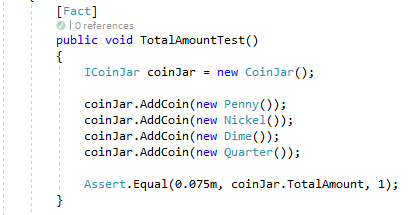
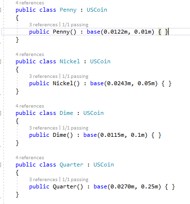
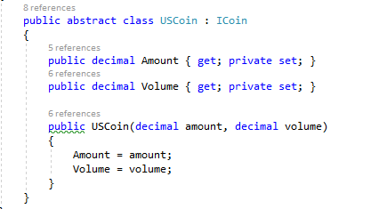

# .NET

## Stack Overflow migrates to .NET Core

Nick Craver recently tweeted about Stack Overflow's pending migration to .NET Core. SO is a big Microsoft partner, and a lot of the development team there have good relationships with the Microsoft .NET development team members. They are now betting the future of SO on .NET Core and .NET Standard. This is very good news for the community at large.

<blockquote class="twitter-tweet" data-lang="en"><p lang="en" dir="ltr">As of this morning, the Stack Overflow Architecure team’s #1 priority is upgrading our infrastructure to .NET Core. We will be moving smaller greenfield apps very soon and I’m laying out the process of upgrading Stack Overflow itself now.</p>&mdash; Nick Craver (@Nick_Craver) <a href="https://twitter.com/Nick_Craver/status/1004484613698457602?ref_src=twsrc%5Etfw">June 6, 2018</a></blockquote>
<script async src="https://platform.twitter.com/widgets.js" charset="utf-8"></script>

## Code Review Challenge

Earlier in the month I sent out an email to the .NET peeps asking for feedback regarding three snippets of code. It was a small code review challenge. Here is that email:

<blockquote>
Yo guys,
So I found this:

The unit test (it passes):



The coins:



The base class:



There is both a programming flaw, and a "way of working" flaw here. Can you spot them?

</blockquote>

If you were not on that mail, take a few moments to review the three pieces of code before reading further.

</br>

### The programming flaw

Consider this line of code: 

```
public Penny() : base(0.0122m, 0.01m) { }
```

It takes two values in the constructor. At this point I don't know what 0.0122 means, or represents. It's a bit arbitrary, right? But 0.01? Oh right, a penny is worth $0.01. That makes perfect sense. And so, in his US coins definition code, it is indeed the case that he sets up each type of coin with the amount it is worth:

```
public Nickel() : base(0.0243m, 0.05m) { }
...
public Dime() : base(0.0115m, 0.1m) { }
...
public Quarter() : base(0.0270m, 0.25m) { }
...
```

Then you see that each of these _type-of-coin_ classes extend the same base class, `USCoin`, so lets follow that and have a look:

```
    public abstract class USCoin : ICoin
    {
        public decimal Amount { get; private set; }
        public decimal Volume { get; private set; }

        public USCoin(decimal amount, decimal volume)
        {
            Amount = amount;
            Volume = volume;
        }
    }
```    

Looks legit? Look again at the constructor. Of the two parameters it takes one is indeed the amount, but it is the _first_ parameter. The other arbitrary value is the volume, and it is second. Given this code, a penny here is not worth $0.01, but instead $0.0122 instead. Totally wrong!

### The testing flaw

So, this is a pretty bad mistake and should show up _immediately_ when running the code, right? I mean, super simple arithmetic will show us that this is wrong, e.g. 100 pennys == 1 dollar, but 100 * 0.0122 = $1.22

In the test a few coins are added together. A penny, a nickel, a dime, and a quarter. So, this means we should have a sum of $0.01 + $0.05 + $0.1 + $0.25 = $0.41, but what does the unit test assert?

```
Assert.Equal(0.075m, coinJar.TotalAmount);
```

This is completely the wrong value! But where does it come from though? Easy, you add the defined volumes of the four types of coins: 0.0122 + 0.0243 + 0.0115 + 0.0270 = 0.075!

### How do we miss things like this?

This asserted value, 0.075, just happens to be a pretty round-ish value, so when we do a glance-over type of code review it's easy to _assume_ it is correct because it _looks_ correct. However the _main_ problem here is that it is clear the **unit test was written _after_ the code was written**. There are two possible routes in this narrative:

#### Self-doubt

The developer wrote all his code, his coin classes and so on, and then completed the unit test. The unit test failed. He checked the actual result in the unit test using the debugger (or the `Assert.Equal` exception message) and saw that "_oh, it's 0.075 actually.. hmm... I must have made a mental calculation error.._" and proceeded to **fix the unit test assert** instead of his code, **assuming his code is correct**.

#### Not even bothering

The developer wrote all his code, his coin classes and so on, and then wrote part of the unit test without the assert. He put a breakpoint in the test and used the debugger to see the actual result, and then **completed the unit test assuming his code result was correct**.

### Don't fall into this trap

We've all heard it before: **Assumption is the mother of all fuckups**. Excuse the french, but it's as literal as that, and the real world conseqences are even more dire. When developers (and this was a candidate applying for a senior position) thinks that their code is unbeatable, things start to fall apart very quickly. Senior developers suffer most from this.

When you code <del>review</del> glance ("_looks good enough_") things are missed, rework happens and your sprint quality drops. When you unit test, and you write your tests with the assumption that your code is good, expect to be proven wrong.

 Here's the thing that I think we forget too often: **Programming is really hard.** There are a lot of peripheral things we need to consider when we program like convention, naming, structure and so on before we even get to our logic and understanding of the problem to solve. Don't assume you (or the other person) understand, and don't assume your (or the other person's) reasoning is sound.

 ### The take-away

 Even if you didn't read any of the above, the TL;DR is
 
 * TTD is a proven process that works, so follow it. It is the GK development process standard.
 * So from above, always write your tests first and write your tests using results you calculated manually, results referenced from examples in the BRS or results from some other out of band channel available to you. **You cannot write any code unless you know how you are going to test it**.
 * Pay attention when you are self-reviewing, and be super critical of yourself.
 * Pay attention when you are code-reviewing, and be wary of the other person's code.

## Software is a craft

Following on from the "programming is really hard" statement before, here's a thread musing about building software as being a craft more than an engineering exercise:

<blockquote class="twitter-tweet" data-lang="en"><p lang="en" dir="ltr">I&#39;ve been thinking a lot about domain-oriented OO vs pattern-oriented OO  because domain-oriented OO is usually thought of as &quot;unteachable,&quot; and  that fact showcases the way developer education is broken.<a href="https://t.co/gODy3mbF8F">https://t.co/gODy3mbF8F</a></p>&mdash; betsythemuffin (@betsythemuffin) <a href="https://twitter.com/betsythemuffin/status/1006597377413795842?ref_src=twsrc%5Etfw">June 12, 2018</a></blockquote>
<script async src="https://platform.twitter.com/widgets.js" charset="utf-8"></script>

This is very philosophical, but I think this kind of thought process is really transformative to how we approach design and write software, e.g. a few of you have heard me refer to what I do here are "surgery". My take-aways from this thread are the following: 
* Cookie-cutter design rules doesn't always apply. We design for the use case, and sometimes that use case is emergent.
* There is always deep understanding that needs to be accomplished in a collaborative way on the team level.

What are your thoughts?