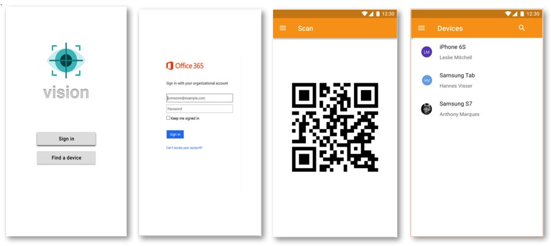

# QA

## vision - GK's very own asset tracking app

For the past month, the QA team has been working on an internal project as part of our tech sessions. Although still in requirements phase, we wanted to give you some insight into this.

### Problem
As a team who use mobile devices for testing on a daily basis, we have difficulty keeping track of where they are or who they are loaned out to. We currently manage this by a manual process which involves the borrower filling in a check out sheet which is not ideal.

### Solution
To solve this problem, the team has decided to work on developing a mobile app that streamlines this process along with providing visibility on these assets ... hence the name 'vision'.
By use of QR code scanner technology, the app will scan a barcode on the device and automatically log all relevant information such as the borrower's details and device specifications to a central database. Additionally, it will offer a dashboard view of all devices and their locations.

Here are some mock-ups of the app:

As mentioned, it is still in very early stages as we are treating this project as any other at GK. We are hoping that this will help us gain more insight into other key roles in the business as well as improve our development skills. 
Watch this space for more updates...