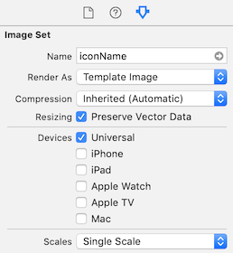

# iOS

## How to easily use SGV/PDF assets in your apps

### Why though?

SVGs are:

- Scalable (1 image instead of a minimum of 3 `png` files to represent the same icon)
- Easy to create and edit
- Smaller than `png` equivalents (in `bytes`)
- Easy to modify the color of the icon in the app.


### How to:

1. Make sure [**CairoSVG**](https://cairosvg.org/) is installed. Just copy-pasta these 2 commands below into your Terminal

	```
	brew install python3 cairo pango gdk-pixbuf libffi
	
	pip3 install cairosvg
	```
2. Convert all your SVG icons to PDF files. Run this command for each icon file:

	```
	cairosvg icon.svg -o icon.pdf
	```
3. Drag the converted PDF files into your Xcode `Assets.xcassets` folder
4. Adjust the settings for each icon in your `xcassets`
	1. Set `Name` to a usable name which you can use to reference your image in code.
	2. Set `Render As` to `Template Image`. The system basically ignores the image's colour information and creates an image stencil based on the alpha values in the image.
	3. Check the box for `Resizing – Preserve Vector Data`. Lets the system treat the image as a vector at runtime.
	4. Set `Scales` to `Single Scale`. This will ensure that the image scales correctly.

<p align="center">
  
</p>

Now the icons can be used in your app as in the simple example below.

```
if let icon = UIImage(named: "iconName") {
    let image = UIImageView(image: icon)
    image.translatesAutoresizingMaskIntoConstraints = false
    image.tintColor = .blue
    view.addSubview(image)
}
```