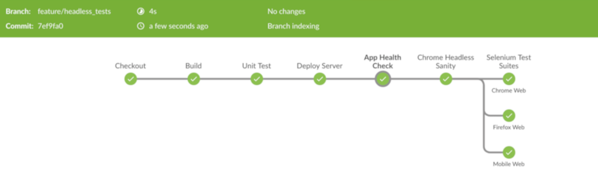

# QA

## Selenium headless mode tests on Chrome and Firefox

Running real browser based UI functional tests with selenium webdriver poses a few challenges such as:
- Real browsers include a GUI and features that are not always required for functional testing. It also makes the browsers more resource intensive and slower to execute automated commands
- Setting up and scaling large number of real browser tests execution on CI using selenium grid can become difficult.

#### What are Headless Browsers?
A headless browser is a web browser without a graphical user interface. Headless browsers provide automated control of a web page in an environment similar to popular web browsers, but are executed via a command-line interface.

#### Why Headless Tests?
Before Google Chrome 59 and Firefox 56 the headless execution was done by third party headless browsers like PhantomJS, SlimerJS, HTMLUnit etc. 
The downfall of these tools is that they only emulate some engines but Chrome Engine or Gecko (Firefox Engine). 
Furthermore, they are not the real browser, and in most cases a bug found using a headless browser like PhantomJS may actually not be a bug.

#### Chrome and Firefox Headless Mode
Chrome and Firefox added support for a headless flag so it could be started without any GUI.
Running smaller tests under the headless version of Chrome/Firefox allows us to test features in lesser time & improve memory usage.
Headless running mode supports all the commands available in WebDriver and has the ability to generate screenshots. 
Apart from display, there is no difference in headless execution mode.

Since tests can be executed quicker, we could implement them as sanity checks into our existing pipelines:



####How to use Headless Mode in your automation:
```java
@BeforeClass
public void setup() throws MalformedURLException {
    ChromeOptions options = new ChromeOptions();
    options.addArguments("--headless");
    WebDriverManager.chromedriver().setup();
    driver = new Chromedriver(options);
  }
```

```java
@BeforeClass
public void setup() throws MalformedURLException {
     FirefoxOptions options=new FirefoxOptions();
     options.addArguments("--headless");
     WebDriverManager.firefoxdriver().setup();
     driver = new FirefoxDriver(options);
  }
```