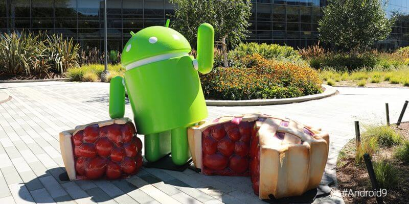

# Android

  

## Interesting Finds and Misc
  - [Android Pie](https://developer.android.com/about/versions/pie/android-9.0)
   - Pie (Android v9 / API 28) started rolling out last month. 
   - Check [here](https://www.pocket-lint.com/phones/news/google/144511-when-is-android-pie-coming-to-my-phone) to find out when or if you will get it.
  - [You can't learn everything](http://fragmentedpodcast.com/episodes/135/)
   - Awesome podcast for any developer new and old, applicable to any ecosystem in IT. 
 
## Tips and Tricks
  - [Android TDD](https://www.raywenderlich.com/7109-test-driven-development-tutorial-for-android-getting-started)
    - Another TDD tutorial, there's probably a million articles similar to this especially in the Java space.
  - [Notifying your users with FCM](https://android-developers.googleblog.com/2018/09/notifying-your-users-with-fcm.html)
   - Firebase Cloud Messaging (Push Notifications) and how to use it wisely.